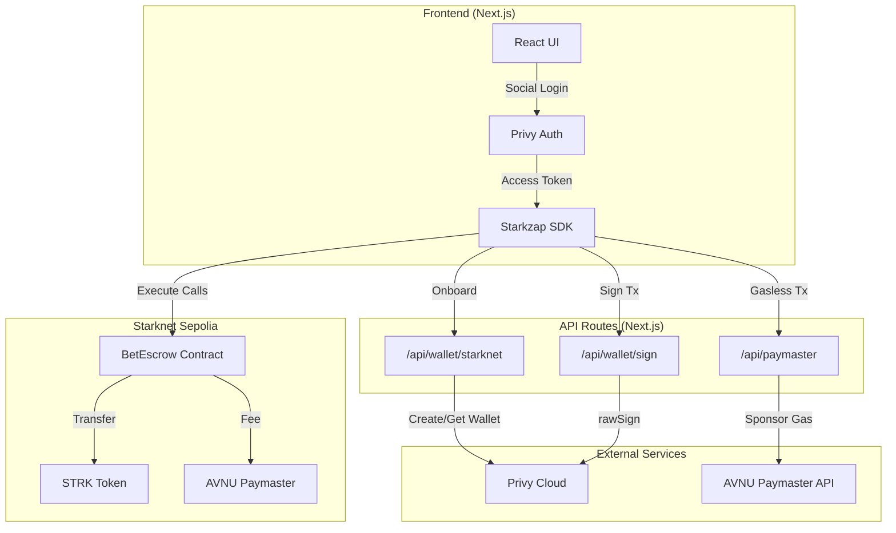
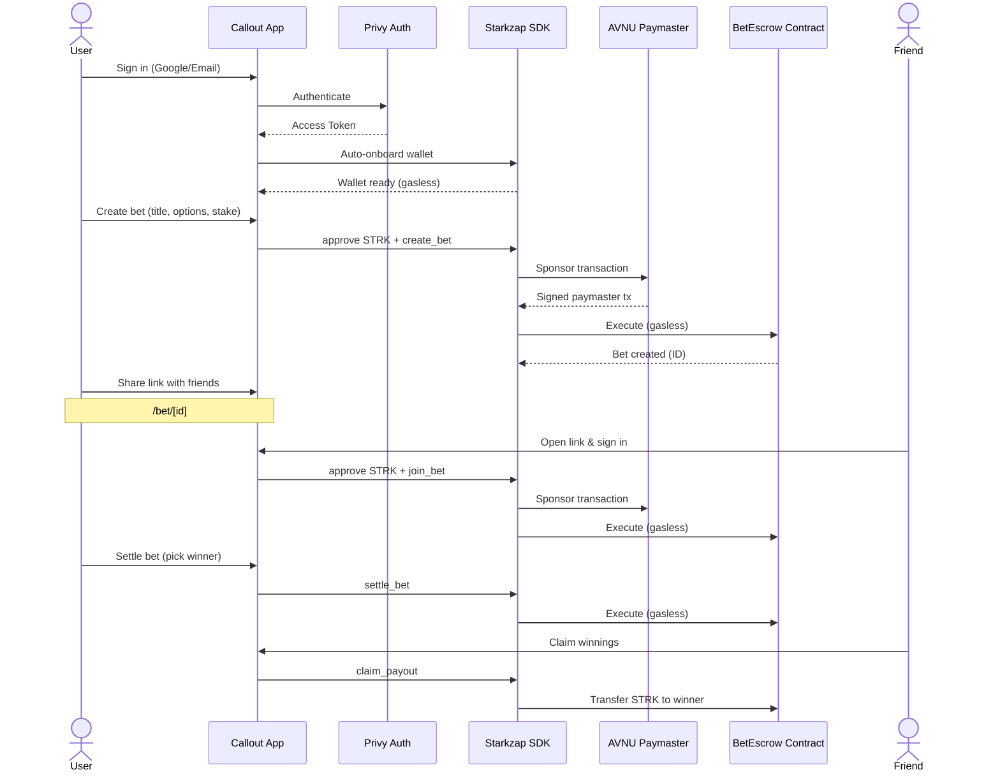

# Callout — Gasless Prediction Markets for Friends

> Bet STRK tokens on anything with your friend group. No wallet setup, no gas fees, no friction.

**Live Demo:** [calloutzap.vercel.app](https://calloutzap.vercel.app/)  
**GitHub:** [github.com/ivedmohan/Callout](https://github.com/ivedmohan/Callout)

Built on [Starknet](https://starknet.io) with [Starkzap SDK](https://starkzap.io).

---

## What is Callout?

Callout is a social prediction market where friends bet on anything — sports results, personal dares, pop culture outcomes — with automatic settlement. Users sign in with Google or email, stake STRK tokens gaslessly, and winners get paid automatically.

**No seed phrases. No gas fees. No manual payouts.**

---

## Deployed Contract

| Parameter | Value |
|-----------|-------|
| **Network** | Starknet Sepolia |
| **Contract Address** | [`0x04d5da31a4ebf09166864035f0f02feb02085224204a0fccc44ab7b1d9d6c02a`](https://sepolia.voyager.online/contract/0x04d5da31a4ebf09166864035f0f02feb02085224204a0fccc44ab7b1d9d6c02a) |
| **STRK Token** | `0x04718f5a0fc34cc1af16a1cdee98ffb20c31f5cd61d6ab07201858f4287c938d` |
| **Paymaster** | AVNU Paymaster (Sepolia) |

---

## Architecture



---

## User Flow



---

## Smart Contract: BetEscrow

### Interface

```cairo
#[starknet::interface]
trait IBetEscrow<TContractState> {
    fn create_bet(title: felt252, option_a: felt252, option_b: felt252,
                  stake_amount: u256, deadline: u64) -> felt252;
    fn join_bet(bet_id: felt252, option: u8);
    fn settle_bet(bet_id: felt252, winning_option: u8);
    fn claim_payout(bet_id: felt252);
    fn get_bet(bet_id: felt252) -> Bet;
    fn get_participant(bet_id: felt252, index: u32) -> Participant;
    fn get_bet_count() -> felt252;
}
```

### Payout Logic

```
Payout per winner = Total Pot / Number of Winners
```

- All staked STRK goes into a shared pot
- Only the creator can settle (creator = oracle for MVP)
- Winners split the pot equally
- Losers receive nothing

---

## Features

- **Social Login** — Sign in with Google or email via Privy
- **Gasless Transactions** — AVNU Paymaster sponsors all gas fees
- **Create Bets** — Pick a topic, set two options, choose a stake amount
- **Shareable Links** — Send `/bet/[id]` to friends to join
- **Auto Payout** — Smart contract distributes STRK to winners proportionally
- **Dashboard** — Track all your active and settled bets
- **Probability Bars** — Polymarket-style horizontal vote split visualization
- **Donut Chart** — Visual ring chart showing option distribution
- **Earnings Potential** — See projected payout, profit & ROI before betting
- **Friendly Errors** — Human-readable error messages, not raw RPC JSON

---

## Tech Stack

| Layer | Technology |
|-------|-----------|
| Frontend | Next.js 16 (TypeScript), Tailwind CSS v4, React 19 |
| Blockchain SDK | [Starkzap](https://starkzap.io) — social login, gasless txs, STRK ops |
| Smart Contracts | Cairo (Starknet) — BetEscrow contract |
| Auth | Privy via Starkzap (Google/email login) |
| Gas | AVNU Paymaster via Starkzap (free for users) |
| Wallet Storage | Privy User Custom Metadata (serverless-compatible) |
| Deployment | Vercel |
| Contract Tooling | [cairo-coder.com](https://www.cairo-coder.com) |

---

## Project Structure

```
callout/
├── contracts/
│   └── bet_escrow.cairo       # Cairo smart contract
├── src/
│   ├── app/
│   │   ├── api/               # Next.js API routes (wallet, sign, paymaster)
│   │   ├── layout.tsx         # Root layout with providers
│   │   ├── page.tsx           # Landing page
│   │   ├── create/page.tsx    # Create a bet
│   │   ├── bet/[id]/page.tsx  # View / join a bet
│   │   └── dashboard/page.tsx # My bets dashboard
│   ├── components/
│   │   ├── Navbar.tsx         # Navigation bar
│   │   ├── BetCard.tsx        # Bet card with probability bar
│   │   ├── ProbabilityBar.tsx # Horizontal vote split bar
│   │   ├── DonutChart.tsx     # SVG donut chart
│   │   ├── EarningsPotential.tsx # Projected payout card
│   │   ├── CalloutLogo.tsx    # SVG logo component
│   │   ├── Button.tsx         # Reusable button component
│   │   └── LoadingSpinner.tsx # Loading states
│   ├── hooks/
│   │   └── useWallet.ts       # Wallet connection + auto-onboard
│   ├── lib/
│   │   ├── starkzap.ts        # Starkzap SDK init & Privy onboarding
│   │   ├── contract.ts        # Contract interaction helpers
│   │   ├── constants.ts       # Network/contract constants
│   │   └── errors.ts          # Human-friendly error parser
│   └── types/
│       └── index.ts           # TypeScript type definitions
├── public/
│   └── logo.svg               # Geometric logo (SVG)
├── .env.local                 # Environment variables (not committed)
├── claude.md                  # AI context file
└── README.md
```

---

## Quick Start

### Prerequisites

- Node.js 18+
- A [Privy](https://console.privy.io/) app (App ID + Secret)
- An [AVNU Paymaster](https://portal.avnu.fi/) API key (funded with STRK)

### 1. Install Dependencies

```bash
npm install
```

### 2. Configure Environment

Create `.env.local`:

```env
NEXT_PUBLIC_NETWORK=sepolia
NEXT_PUBLIC_CONTRACT_ADDRESS=0x04d5da31a4ebf09166864035f0f02feb02085224204a0fccc44ab7b1d9d6c02a
NEXT_PUBLIC_PRIVY_APP_ID=your-privy-app-id
PRIVY_APP_SECRET=your-privy-secret
PAYMASTER_API_KEY=your-avnu-key
```

### 3. Start Development Server

```bash
npm run dev
```

Runs on `http://localhost:3000`.

### 4. Deploy Smart Contract

```bash
cd contracts
scarb build
# Deploy with Starknet CLI or snforge
```

Or vibe-code at [cairo-coder.com](https://www.cairo-coder.com).

---

## Resources

- [Starkzap Docs](https://docs.starknet.io/build/starkzap/overview)
- [Starkzap Repo](https://github.com/keep-starknet-strange/starkzap)
- [Awesome Starkzap](https://github.com/keep-starknet-strange/awesome-starkzap)
- [Starkzap Step-by-step Tutorial](https://github.com/starkience/winky-starkzap)
- [Cairo Coder (Vibe-code contracts)](https://www.cairo-coder.com)
- [Starknet Faucet (Sepolia)](https://starknet-faucet.vercel.app/)

## License

MIT
